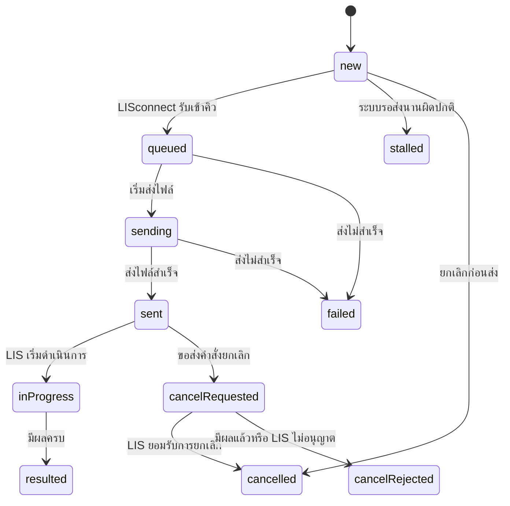

# LIS and HIS Integration Flow

ไฟล์แนะนำสำหรับนำเข้า draw.io: [LIS_HIS_Integration_Flow_Simple.mmd](./LIS_HIS_Integration_Flow_Simple.mmd)

ไฟล์ฉบับละเอียดสำหรับอ้างอิงทางเทคนิค: [LIS_HIS_Integration_Flow.mmd](./LIS_HIS_Integration_Flow.mmd)

## ภาพรวมการทำงาน

### HIS ส่งคำสั่งตรวจไป LIS

1. HIS สร้าง `order_no` และ `labno` ก่อนส่งทุกครั้ง
2. HIS ส่ง JSON ไปที่ `POST {AGENT_URL}/api/orders` พร้อม `X-Agent-Key`
3. LISconnect ตรวจสิทธิ์ รูปแบบ JSON, `labno`, รายการ `items[]` และ routing
4. ถ้าผ่าน LISconnect จะ commit ลง Queue แล้วตอบ `202 Accepted`
5. ถ้า `order_no` เดิมถูกส่งซ้ำ จะตอบ `200` และ `duplicate:true` โดยไม่สร้างไฟล์ซ้ำ
6. LISconnect แปลง JSON เป็น HL7 `ORM^O01` และสร้างไฟล์ `.req` แบบ TIS-620 ส่งให้ LIS
7. สถานะใบสั่งถูกส่งกลับ HIS ผ่าน `hl7_order_status_sync`

ข้อมูลรายการตรวจที่มีอยู่ในสัญญาปัจจุบัน ได้แก่ `test_code`, `test_name`, `specimen_code`, `specimen_name`, `collector_code` และ `collector_name`

### LIS ส่งผลกลับ HIS

1. LIS สร้างไฟล์ `.res` เมื่อมีผล Preliminary, Partial, Final หรือ Corrected
2. LISconnect อ่านไฟล์แล้วแปลงเป็น JSON
3. LISconnect เรียก HIS process `hl7_result_upsert` ด้วย Bearer JWT
4. HIS จับคู่ใบสั่งจาก `filler_order_no` ซึ่งเป็น Lab No. และตรวจซ้ำด้วย `order_no` กับ `visit_id`
5. HIS ป้องกันผลซ้ำด้วย `result_uid`
6. ผลหลายรอบต้องเพิ่มตาม `report_seq` และ `stage` ไม่ทับรายงานเดิม
7. ผลแก้ไขต้องเพิ่ม `result_version` พร้อมเก็บประวัติค่าเดิม
8. ถ้าผลที่จำเป็นยังไม่ครบ สถานะเป็น “ออกผลบางส่วน”; เมื่อครบจึงเป็น “ออกผลครบ”

ข้อมูลผลที่มีอยู่ในสัญญาปัจจุบัน ได้แก่ `obs_code`, `obs_name`, `value`, `units`, `ref_range`, `obx_status`, `change_kind`, `receipt_seq` และ `result_version`

## สถานะใบสั่งที่ HIS ต้องรองรับ

ชื่อจริงที่ API ใช้คือ `in_progress`, `cancel_requested` และ `cancel_rejected`

## จุดที่ต้องยืนยันกับทีม LIS ก่อนล็อก CPOE Item Master

สเปกและตัวอย่าง JSON ชุดนี้ยังไม่มีฟิลด์ชื่อ `his_code_id`, `lis_code_id`, `TMLT` หรือ `c_specimen` โดยตรง จึงยังสรุปแทนกันเองไม่ได้ ต้องยืนยัน 4 ข้อนี้ก่อน:

1. `items[].test_code` ที่ HIS ส่ง คือ `his_code_id`, LIS order code หรือรหัสอีกชุดหนึ่ง
2. `items[].obs_code` ที่ LIS ส่งกลับ ใช้รหัสเดียวกับ `test_code` หรือเป็นรหัสผลตรวจย่อย
3. `c_specimen` ต้อง map ไปที่ `items[].specimen_code` ใช่หรือไม่
4. TMLT เก็บเฉพาะใน Master เพื่ออ้างอิง หรือจำเป็นต้องเพิ่มใน API contract ด้วย

เนื่องจาก CPOE Item หนึ่งรายการอาจส่ง LIS ได้หลายรหัส การ mapping ควรเป็นตารางลูกแบบหนึ่งต่อหลาย ไม่ควรเก็บ LIS code เดียวไว้ใน record หลักของ CPOE Item

## วิธีนำเข้า draw.io

1. เปิด draw.io หรือ diagrams.net
2. เลือก **Arrange → Insert → Advanced → Mermaid**
3. เปิดไฟล์ `LIS_HIS_Integration_Flow.mmd` แล้วคัดลอกทั้งหมดไปวาง
4. เลือก **Diagram** หากต้องการแก้กล่องและเส้นภายหลัง

## แหล่งข้อมูลที่ใช้

- `/Users/nichada/Documents/LIS/his-order-submit-spec.md`
- `/Users/nichada/Documents/LIS/his-order-sample.json`
- `/Users/nichada/Documents/LIS/his-result-sample.json`
