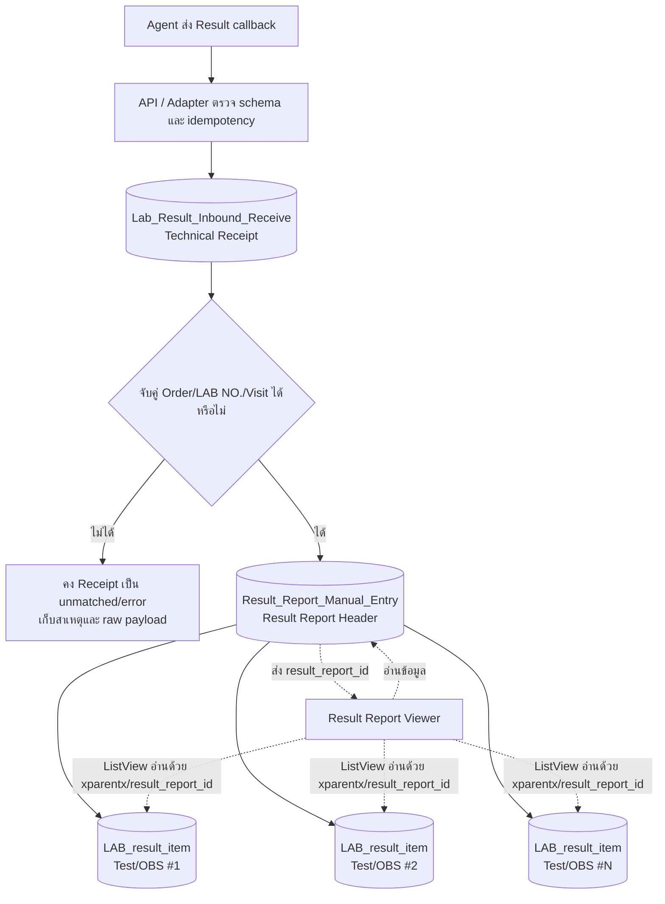

# ความสัมพันธ์ของระบบรับและแสดงผล Lab: 3 Data Forms + 1 Viewer UI

อัปเดต: 25 สิงหาคม 2569 (Asia/Bangkok)

## 1. จุดประสงค์ของเอกสาร

เอกสารนี้อธิบายเหตุผลที่ระบบผล Lab แยกข้อมูลเป็น 3 ฟอร์ม และมี UI ปลายทางอีก 1 ฟอร์ม ได้แก่:

1. `Lab_Result_Inbound_Receive` — เก็บข้อความที่รับจาก Agent
2. `Result_Report_Manual_Entry` — เก็บหัวชุดรายงานผลของหนึ่งงาน/หนึ่ง LAB NO.
3. `LAB_result_item` — เก็บผลตรวจแต่ละ Test/OBS
4. `Result Report Viewer` — หน้าจอแสดงหัวรายงานและรายการผล ไม่ใช่ตารางข้อมูลเพิ่ม

คำว่า **Report** ในเอกสารนี้หมายถึง “ชุดข้อมูลผลตรวจของ LAB NO. หนึ่งงาน” ไม่ได้หมายถึงเอกสาร PDF หรือ Report Factory หากต้องพิมพ์เอกสารผล Lab จะต้องมีปุ่ม/Report Factory แยกต่างหากในภายหลัง

## 2. ฟอร์มและตารางที่ตรวจพบในระบบปัจจุบัน

| ชั้น | Form | Form ID | ประเภท | Collection/Table | หน้าที่ |
|---|---|---|---|---|---|
| 1 | `Lab_Result_Inbound_Receive` | `6a8b1c03f851000f28e501ef` | CRUD (`form_db`) | `zdata_lab_result_inbound` | Technical receipt ของข้อความ Agent |
| 2 | `Result_Report_Manual_Entry` | `6a8d4334f851000f28e5025b` | CRUD (`form_db`) | `zdata_lab_report_manual_entry` | หัวชุดผลตรวจหนึ่งงาน/หนึ่ง LAB NO. |
| 3 | `LAB_result_item` | `6a8bc91df851000f28e501fb` | CRUD (`form_db`) | `zdata_lab_result_item` | ผลราย Test/OBS หนึ่ง record ต่อ result component |
| UI | `Result Report Viewer` | `6a8d5620f851000f28e50270` | UI (`form_ui`) | ไม่มีตาราง | แสดง Report header + Result Items และเปิดฟอร์มแก้ผลรายตัว |

ข้อเท็จจริงจาก live configuration ณ วันที่อัปเดต:

- ทั้ง 4 ฟอร์มเปิดใช้งานอยู่
- `LAB_result_item` เปิด Join Parent ไปยัง `Result_Report_Manual_Entry` แล้ว
- `Lab_Result_Inbound_Receive` ไม่มี Join Parent ซึ่งถูกต้องสำหรับ receipt
- `Result_Report_Manual_Entry` ยังไม่มี Join Parent ใน live configuration ปัจจุบัน และอ้างงาน Lab ภายนอกด้วย `order_status_id`
- `Result Report Viewer` เป็น `form_ui` ไม่มี schema/table สำหรับบันทึก record ของตัวเอง

## 3. ภาพรวมความสัมพันธ์ที่ถูกต้อง



Cardinality ที่ควรจำ:

```text
Agent Result Messages / Receipts  หลายข้อความ
                    │
                    │ materialize/upsert ผ่าน API
                    ▼
Result Report Header             1 ชุดต่อ logical Lab result work
                    │
                    │ Join Parent 1:N
                    ▼
Result Items                     หลายรายการต่อ Report
```

ดังนั้นสามฟอร์มนี้ **ไม่ใช่ 1 record → 1 record → 1 record เสมอไป**:

- ผลบางส่วน, ผลครบ และผลแก้ไข อาจมี Receipt หลายข้อความของ Report เดียวกัน
- Report หนึ่งชุดมี Result Item ได้หลายรายการ
- Panel/Test หนึ่งรายการสั่งอาจแตกเป็นหลาย OBS/result components ได้

## 4. ทำไมต้องแยกเป็น 3 ฟอร์ม

### 4.1 Receipt ต้องแยกจากข้อมูลที่ผู้ใช้ดู

ข้อความจาก Agent อาจซ้ำ, จับคู่ไม่สำเร็จ, schema ผิด, เป็น partial result หรือเป็น correction หากบันทึกทับ Report โดยตรงจะเสียหลักฐานของข้อความต้นทางและหาสาเหตุย้อนหลังยาก

`Lab_Result_Inbound_Receive` จึงทำหน้าที่เหมือนกล่องรับข้อความและ audit ทางเทคนิค โดยเก็บข้อความไว้ได้แม้ยังสร้าง Report/Item ไม่สำเร็จ

### 4.2 Report Header ต้องแยกจาก Result Item

ข้อมูลระดับ LAB NO. เช่น HN, VN, ผู้ลงผล, ผู้รับรองผล, เวลารายงาน และสถานะรวม ไม่ควรถูกทำซ้ำเป็น record หลักของทุกผลตรวจ การมี Report Header ทำให้:

- ค้นรายการที่ออกผลแล้วได้หนึ่งแถวต่อ LAB NO./งาน
- คำนวณสถานะรวม `กำลังตรวจ` / `ออกผลบางส่วน` / `ออกผลครบ`
- เปิดผลทั้งหมดของงานจากปุ่ม `ดูผล` ได้
- รองรับทั้ง Agent/LIS และ Manual ในหน้าปลายทางเดียวกัน

### 4.3 Result Item ต้องเป็น record แยกต่อผลตรวจ

แต่ละ Test/OBS มีชนิดผล, ค่า, หน่วย, Ref. Range, interpretation, critical และ version ต่างกัน การแยก `LAB_result_item` ทำให้ update ผลบางรายการโดยไม่เขียนทับรายการอื่น และรองรับ Panel ที่มีหลาย result components

## 5. Schema ชั้นที่ 1: `Lab_Result_Inbound_Receive`

### 5.1 ความหมายของ record

หนึ่ง record คือข้อความผลที่ HIS รับจาก Agent หนึ่งเหตุการณ์ โดย `record_kind` มีค่าเริ่มต้น `receipt`

ฟอร์มนี้เป็น technical receipt ไม่ใช่หน้ากรอกผล และไม่ควรให้ผู้ใช้ทั่วไปแก้ค่าที่ Agent ส่งมา

### 5.2 กลุ่ม field สำคัญ

#### A. ตัวตนของข้อความและการกันข้อมูลซ้ำ

| Field | หน้าที่ |
|---|---|
| `result_uid` | Idempotency key ของข้อความผลจาก Agent ใช้ตรวจ retry/duplicate |
| `report_seq` | ลำดับการรายงานที่มากับข้อความ เก็บเป็น string ตาม wire schema |
| `stage` | ขั้น/สถานะของข้อความ เช่น partial/final/corrected ตาม contract |
| `source_channel` | ช่องทางต้นทาง ค่าเริ่มต้น `agent` |
| `schema_version` | รุ่น schema ที่ใช้รับข้อความ ค่าเริ่มต้น `his-agent-result-v1` |
| `payload_hash` | Hash สำหรับช่วยตรวจ payload ซ้ำหรือเปลี่ยนแปลง |
| `received_at` | เวลาที่ HIS รับข้อความจริง |

#### B. ตัวระบุ Order และผู้ป่วยเพื่อจับคู่

| Field | หน้าที่ |
|---|---|
| `order_no` | Order number ต้นทาง |
| `filler_order_no` | LAB NO. / Filler Order No. |
| `hn` | Hospital Number ใช้บริบทและ cross-check |
| `visit_id` | VN/Visit ID ใช้ร่วมในการจับคู่ |
| `order_status_id` | อ้าง Lab Work Item/สถานะรายการสั่งใน HIS เมื่อจับคู่ได้ |
| `lab_section`, `lab_section_name` | ห้อง Lab/section ที่เกี่ยวข้อง |

การจับคู่ห้ามใช้ HN หรือ LAB NO. ค่าเดียวโดยลำพัง อย่างน้อยต้องใช้ชุด identifier ที่ integration contract ยืนยัน เช่น `order_no + filler_order_no + visit_id`

#### C. สถานะและข้อมูลรายงานจาก Agent

| Field | หน้าที่ |
|---|---|
| `receipt_status` | สถานะการรับและประมวลผล receipt |
| `agent_overall_status` | สถานะรวมที่ Agent ส่งมา |
| `internal_overall_status` | สถานะที่ HIS แปลงไว้ใช้ภายใน |
| `reported_at` | เวลารายงานผลจากต้นทาง |
| `reported_by_source_id`, `reported_by_source_name` | รหัส/ชื่อผู้ลงผลจากต้นทาง |
| `verified_at` | เวลารับรองผล ถ้ามี |
| `verified_by_source_id`, `verified_by_source_name` | รหัส/ชื่อผู้รับรองผล ถ้ามี |

#### D. สรุปการแตกและจับคู่ items

| Field | หน้าที่ |
|---|---|
| `item_count` | จำนวนรายการใน `items[]` |
| `critical_count` | จำนวนรายการที่ Agent ระบุว่า critical |
| `matched_item_count` | จำนวน items ที่ map เข้ารายการผลได้ |
| `unmatched_item_count` | จำนวน items ที่ map ไม่สำเร็จ |
| `items_json` | Snapshot ของ `items[]` ในข้อความ |

#### E. ผลการ materialize และ audit ทางเทคนิค

| Field | หน้าที่ |
|---|---|
| `result_report_id` | ID ของ Report Header ที่ receipt นี้ถูกนำไป materialize |
| `processed_at` | เวลาที่ Adapter ประมวลผลเสร็จ |
| `error_message` | สาเหตุกรณี validate/match/materialize ไม่สำเร็จ |
| `raw_payload_json` | Raw message สำหรับตรวจย้อนหลัง |
| `record_kind` | ชนิด record ค่าเริ่มต้น `receipt` |
| `report_key` | Logical key ที่ Adapter ใช้หา Report ที่เกี่ยวข้อง |

### 5.3 ความสัมพันธ์กับฟอร์มอื่น

`Lab_Result_Inbound_Receive` **ไม่ Join Parent** กับ Report เพราะความสัมพันธ์จริงอาจเป็นหลาย Receipt ต่อ Report เดียว และ receipt ที่ unmatched/error ต้องอยู่ได้โดยยังไม่มี Report

การเชื่อมใช้ API/Adapter และ field อ้างอิง:

```text
Receipt.result_report_id → Result_Report_Manual_Entry._id
```

นี่เป็น logical reference ไม่ใช่ Join Parent ของ initCraft

### 5.4 Field ที่ควรแสดงและควรซ่อน

ผู้ดูแลอาจเห็นเฉพาะสถานะ, LAB NO., HN, VN, เวลารายงาน, ผู้ลงผล และผู้รับรองผล ส่วน `result_uid`, schema, raw JSON, hash, counts, IDs และ error diagnostics ควรเป็น internal/read-only และไม่แสดงแก่ผู้ใช้ Lab ทั่วไป

## 6. Schema ชั้นที่ 2: `Result_Report_Manual_Entry`

### 6.1 ความหมายของ record

หนึ่ง record คือหัวชุดผลของหนึ่ง logical Lab result work/LAB NO. ใช้เป็นแถวหลักในหน้า Tab ออกผล และเป็น Parent ของ Result Items

ฟอร์มนี้ **ไม่ใช่เอกสาร PDF** และไม่ใช่ receipt ใหม่

### 6.2 กลุ่ม field สำคัญ

#### A. Header ที่ผู้ใช้ใช้ระบุชุดผล

| Field | หน้าที่ |
|---|---|
| `filler_order_no` | LAB NO. ของชุดผล |
| `hn` | HN snapshot |
| `visit_id` | VN/Visit ID snapshot |
| `order_no` | Order number ต้นทาง |
| `order_status_id` | ID ของ Lab Work Item/Order Status ต้นทาง |
| `lab_section`, `lab_section_name` | Section ของ Lab |

#### B. ผู้รายงาน/ผู้รับรองและเวลา

| Field | หน้าที่ |
|---|---|
| `reported_at` | เวลารายงานผลล่าสุด/เวลาที่ใช้แสดงบนหัวชุดผลตามกติกา |
| `reported_by_source_id`, `reported_by_source_name` | ผู้ลงผลจาก Agent/Manual |
| `verified_at` | เวลารับรองผล ถ้ามี |
| `verified_by_source_id`, `verified_by_source_name` | ผู้รับรองผล ถ้ามี |

#### C. ตัวระบุ logical report และแหล่งข้อมูล

| Field | หน้าที่ |
|---|---|
| `record_kind` | ค่าเริ่มต้น `report` เพื่อแยกจาก receipt |
| `report_key` | Stable logical key สำหรับ get-or-create/upsert Report |
| `result_report_id` | ID อ้างอิงที่ใช้ส่งต่อใน UI/API หาก implementation ต้องใช้ string snapshot |
| `source_channel` | ช่องทางต้นทาง เช่น Agent |
| `schema_version` | รุ่น schema ต้นทาง |
| `result_uid` | UID ของ source message ที่เกี่ยวข้อง/ล่าสุด ไม่ควรใช้เป็น identity เดียวของ Report |
| `report_seq`, `stage` | ลำดับ/ขั้นของผลล่าสุดตาม source contract |

Report อาจรับผลจาก Receipt หลายข้อความ จึงห้ามสร้าง Report ใหม่ทุกครั้งที่ `result_uid` เปลี่ยน ต้องค้นด้วย `report_key` หรือ stable Work Item key ที่ API กำหนด

#### D. สถานะและสรุปผลระดับ Report

| Field | หน้าที่ |
|---|---|
| `receipt_status` | สถานะ materialization ล่าสุด |
| `agent_overall_status` | สถานะรวมจาก Agent |
| `internal_overall_status` | สถานะรวมภายใน HIS |
| `item_count` | จำนวนผลทั้งหมดใน source/report |
| `critical_count` | จำนวน critical items |
| `matched_item_count`, `unmatched_item_count` | สรุปผลการ mapping |
| `processed_at` | เวลาประมวลผลล่าสุด |

#### E. Snapshot/diagnostic ที่ไม่ควรให้ผู้ใช้แก้

| Field | หน้าที่ |
|---|---|
| `items_json` | Snapshot รายการจาก source message |
| `payload_hash` | Hash ของ payload ล่าสุด/ที่เกี่ยวข้อง |
| `error_message` | ข้อผิดพลาดการประมวลผล |
| `raw_payload_json` | Raw payload snapshot |

### 6.3 ความสัมพันธ์กับ Receipt

ความสัมพันธ์ Receipt → Report เป็นการ materialize ผ่าน API ไม่ใช่ Join Parent:

```text
Receipt หลาย record ── result_report_id/report_key ──► Report หนึ่ง record
```

### 6.4 ความสัมพันธ์กับ Result Item

`Result_Report_Manual_Entry` เป็น Parent ของ `LAB_result_item`

Live Join Parent ที่บันทึกแล้ว:

```text
Parent Form       = Result_Report_Manual_Entry
Parent Form ID    = 6a8d4334f851000f28e5025b
Join Parent Field = _id
Child Field Name  = parent_id
```

เมื่อสร้าง child ผ่าน parent context initCraft จะเก็บ parent relation ใน `xparentx` และ join snapshot ใน `parent_id.*` ขณะเดียวกัน Adapter ควรเก็บ `result_report_id` เป็น explicit reference สำหรับ query/idempotency ด้วย

### 6.5 การใช้งาน Manual

Manual Lab ไม่จำเป็นต้องสร้าง Receipt ปลอม เพราะไม่มี Agent message:

```text
Manual workflow
  → get-or-create Result Report จาก Lab Work Item
  → materialize Result Items จากรายการสั่ง/Result Definition
  → เจ้าหน้าที่กรอก result_value
```

Report และ Item จึงเป็น transaction model ที่ใช้ร่วมกันได้ทั้ง Agent/LIS และ Manual

## 7. Schema ชั้นที่ 3: `LAB_result_item`

### 7.1 ความหมายของ record

หนึ่ง record คือหนึ่งผลตรวจที่รายงานได้ เช่น Sodium, Potassium, Creatinine หรือ narrative/organism result หนึ่ง component

หาก Test Item หนึ่งตัวมีหลาย results ต้องมี Result Item หลาย record เรียงตาม `result_sequence` และแสดงต่อเนื่องใต้ panel/test ที่เกี่ยวข้อง

### 7.2 Field ที่ผู้ใช้เห็น

| Field | Widget/สถานะ | หน้าที่ |
|---|---|---|
| `test_name` | Text, readonly | ชื่อ Test Item/ผลตรวจ |
| `result_value` | Textarea, editable | ค่าผล รองรับตัวเลข, ข้อความสั้น และ narrative หลายบรรทัด |
| `unit_symbol_snapshot` | Text, readonly | หน่วย ณ เวลารายงาน |
| `interpretation_code` | Text, readonly | เช่น N/L/H/LL/HH/AA ตามค่าที่ต้นทางส่งหรือระบบ map |
| `reference_range_snapshot` | Text, readonly | Ref. Range ณ เวลารายงาน |
| `is_critical` | Switch, disabled | Critical flag ที่ Agent/LIS/ระบบเป็นผู้กำหนด |

สำหรับ Lab ปกติ ผู้ใช้แก้ได้เฉพาะ `result_value` ส่วน Unit, interpretation, Ref. Range และ Critical ต้องอ่านอย่างเดียว

### 7.3 Parent/reference fields

| Field | หน้าที่ |
|---|---|
| `xparentx` | Parent ObjectId ที่ initCraft ใช้กรอง child records |
| `parent_id.value` | `_id` ของ `Result_Report_Manual_Entry` จาก Join Parent |
| `parent_id.label` | Label ของ Parent |
| `parent_id.filler_order_no`, `parent_id.hn`, `parent_id.visit_id` | Ref snapshot จาก Parent |
| `result_report_id` | Explicit Report ID สำหรับ API/upsert/query |
| `result_definition_id` | Definition ที่ใช้สร้าง item นี้ |

`xparentx`, `parent_id.value` และ `result_report_id` ต้องอ้าง Report เดียวกัน หากไม่ตรงกันถือเป็นข้อมูลเสียความสัมพันธ์

### 7.4 Order, Test, OBS และการจัดกลุ่ม

| Field | หน้าที่ |
|---|---|
| `order_no`, `filler_order_no`, `hn`, `visit_id`, `lab_section` | Context snapshot ของงาน Lab |
| `test_code` | รหัสรายการ/ชุดตรวจตาม source ที่กำหนด |
| `obs_code` | รหัส result component ที่ใช้ map กับ Definition ตาม contract |
| `obs_name` | ชื่อ OBS จาก Agent |
| `panel_code`, `panel_name` | จัดผลหลายรายการให้อยู่ใต้ Panel/Test เดียวกัน |
| `group_role` | บทบาท/ชนิดการจัดกลุ่ม |
| `organism` | ข้อมูล organism สำหรับผลที่เกี่ยวข้อง |
| `result_sequence` | ลำดับแสดงผล |

ห้ามถือว่า `test_code`, `obs_code` และ `his_code_id` เป็นรหัสเดียวกันจนกว่า integration contract จะยืนยัน

### 7.5 Raw source fields และ snapshot fields

| Raw จาก Agent | Snapshot ที่ใช้แสดง |
|---|---|
| `units` | `unit_symbol_snapshot` |
| `ref_range` | `reference_range_snapshot` |
| `obs_name` | `test_name`/ชื่อ snapshot ตาม mapping |

การแยก raw และ snapshot ทำให้ผลเก่าไม่เปลี่ยนตาม Master ที่แก้ในอนาคต

### 7.6 สถานะ, version และ correction

| Field | หน้าที่ |
|---|---|
| `result_source` | `agent` / `lis` / `manual` ตาม implementation |
| `result_status` | `pending`, `entered`, `final`, `corrected` ตามกติกา |
| `result_uid` | UID ของ source result/message |
| `obx_status` | สถานะ OBX/source item |
| `change_kind` | ชนิดการเปลี่ยน เช่น correction |
| `previous_value` | ค่าก่อนแก้จาก source/correction |
| `receipt_seq` | ลำดับ receipt ที่นำมา update item |
| `result_version` | รุ่นของผลรายตัว |
| `critical_low_rule`, `critical_high_rule` | เกณฑ์/ข้อความ critical ที่ Agent ส่งมา เก็บเป็น snapshot |

### 7.7 Manual audit fields

| Field | หน้าที่ |
|---|---|
| `entered_by`, `entered_at` | ผู้และเวลาที่กรอก Manual ครั้งแรก |
| `last_edited_by`, `last_edited_at` | ผู้และเวลาแก้ล่าสุด |
| `edit_history_json` | ประวัติ old/new value ของทุกการแก้ไข |

การแก้ผลต้อง append audit history ไม่ใช่เขียนทับโดยไม่มีประวัติ

### 7.8 กรณี Microbiology/แลปที่ไม่มีเครื่อง LIS

แนวทางคือสร้าง Result Items จาก order/definition ก่อน แล้วให้เจ้าหน้าที่กรอก `result_value` โดยยังใช้ Report/Item schema เดียวกับผลจาก Agent

ข้อควรระวังใน schema ปัจจุบัน:

- `is_critical` ถูกตั้ง disabled จึงยังไม่รองรับการกรอก Critical แบบ Manual โดยตรง
- หาก Microbiology ต้องกรอก Critical เอง ต้องกำหนดรูปแบบและ audit ที่ชัดเจนก่อน เช่น critical flag + เหตุผล/ผู้บันทึก ห้ามเปิด switch เดิมให้แก้โดยไม่มี audit
- Unit อาจไม่มีค่า ให้แสดง `-` หรือเว้นว่างตาม requirement ไม่ควรสร้างหน่วยสมมติ

## 8. UI ปลายทาง: `Result Report Viewer`

### 8.1 บทบาท

`Result Report Viewer` เป็นหน้าจอ UI ไม่ใช่ data form และไม่มี collection ของตัวเอง

หน้าจอนี้จะถูกเปิดจากปุ่ม `ดูผล` ใน ListView ของ Tab ออกผลในหน้า Lab รวมที่ยังจะออกแบบภายหลัง

```text
หน้า Lab รวม → Tab ออกผล
  → ListView source = Result_Report_Manual_Entry
  → Buttons Row: ดูผล
  → open Result Report Viewer พร้อม params.result_report_id
```

### 8.2 ข้อมูลหัวรายงานที่แสดง

Viewer มี field แสดงผลชั่วคราว/read-only:

- `filler_order_no` — LAB NO.
- `hn`
- `visit_id`
- `patient_name`
- `reported_at`
- `reported_by_source_name`
- `verified_at`
- `verified_by_source_name`

ค่าพวกนี้ต้องมาจาก Report record หรือ params/API ตอนเปิด Viewer ไม่ได้ถูกบันทึกใน Viewer เอง

### 8.3 ListView ภายใน Viewer

ListView ชื่อ `result_report_viewer_items_list` ใช้ source form:

```text
LAB_result_item
Form ID = 6a8bc91df851000f28e501fb
```

และกรองรายการด้วย Report ID:

```sql
xparentx = CONVERT('<result_report_id>', 'objectId')
```

ListView แสดง:

- Test Item/Panel
- Result
- Unit
- Interpretation
- Ref. Range
- Critical

ปุ่มภายใน ListView มีความหมายเป็น `ดู / กรอก / แก้ไขผล` และเปิด `LAB_result_item` ราย record โดยส่ง Result Item `_id` เป็น `dataId`

### 8.4 File Upload

Viewer มี widget `result_attachments` สำหรับไฟล์ผล Lab แต่เนื่องจาก Viewer เป็น `form_ui` ไม่มี table ของตัวเอง จึงต้องกำหนด persistence ก่อนใช้งานจริง:

- แนะนำเก็บ attachment metadata ใน Report CRUD หรือ collection เอกสารที่ผูกด้วย `result_report_id`
- Upload URL/process ต้องคืน file metadata แล้ว API บันทึกลงแหล่งข้อมูลดังกล่าว
- การวาง File Upload ใน `form_ui` อย่างเดียวไม่ยืนยันว่า metadata จะถูกเก็บถาวร

## 9. Mapping จาก Agent JSON ไปยัง 3 ฟอร์ม

ตัวอย่างเชิงโครงสร้าง:

```json
{
  "result_uid": "message-uid",
  "order_no": "order-no",
  "filler_order_no": "lab-no",
  "hn": "hn",
  "visit_id": "vn",
  "report_seq": "1",
  "stage": "resulted",
  "reported_at": "ISO-8601",
  "items": [
    {
      "obs_code": "OBS-1",
      "obs_name": "Result component 1",
      "value": "value",
      "units": "unit",
      "ref_range": "range"
    }
  ]
}
```

การ materialize:

```text
Payload ทั้งก้อน
  → Receipt 1 record
     result_uid, order/LAB/VN, stage, raw_payload_json, items_json

Logical Lab result work
  → Report Header 1 record
     report_key, LAB NO., HN, VN, status, reporter/verifier, counts

items[]
  → Result Item N records
     obs_code, test_name, result_value, unit, ref range, critical, version
```

## 10. Stable keys และ idempotency

| ระดับ | Key/หลักการ |
|---|---|
| Receipt | `result_uid` กัน retry/duplicate ของข้อความเดิม |
| Report | `report_key` หรือ stable Work Item key; ห้ามใช้ `result_uid` เดี่ยวเพราะ Report อาจมีหลาย receipts |
| Result Item | อย่างน้อย `result_report_id + result_definition_id` หรือ `result_report_id + stable source result identity`; ต้องรองรับหลาย OBS ใต้ Test/Panel |

Key จริงที่ API ใช้ต้องกำหนดและทดสอบร่วมกับ integration contract ห้ามเดา compound key จากชื่อ field อย่างเดียว

## 11. Flow ของผลจาก Agent เทียบกับ Manual

### Agent/LIS

```text
Agent callback
  → Receipt
  → match/get-or-create Report
  → upsert Result Items
  → recalculate Report status
  → Viewer แสดงผล
```

### Manual

```text
Lab Work Item
  → get-or-create Report (ไม่สร้าง Receipt ปลอม)
  → materialize Result Items จาก ordered tests/definitions
  → เจ้าหน้าที่กรอก result_value
  → update audit + recalculate Report status
  → Viewer แสดงผลในโครงเดียวกับ Agent
```

## 12. สิ่งที่ UI ควรแสดงและไม่ควรแสดง

### ควรแสดง

- LAB NO., HN, VN, ชื่อผู้ป่วย
- รายการ Test/OBS
- Result รองรับข้อความสั้น, ข้อความยาว และตัวเลข
- Unit
- Interpretation
- Ref. Range
- Critical alert
- ผู้ลงผล/ผู้รับรองและเวลาเมื่อมี
- ไฟล์แนบผล Lab

### ไม่ควรแสดงแก่ผู้ใช้ทั่วไป

- `result_uid`, `report_seq`, `stage`, schema version
- raw payload, payload hash, items JSON
- internal IDs และ matching counts
- source IDs ของผู้ลงผล/ผู้รับรอง
- processed/error diagnostics ยกเว้นหน้าผู้ดูแลระบบ
- critical threshold สำหรับแก้ไขโดยผู้ใช้ทั่วไป

## 13. ประเด็นที่ยังต้องทำก่อนใช้งานจริง

1. ทำและทดสอบ API รับ callback, validate schema และ idempotency
2. ยืนยัน stable Report key สำหรับ partial/final/corrected results
3. ทดสอบ Receipt หลายข้อความ materialize เข้า Report เดิม
4. ทดสอบ Result Item upsert โดยไม่เกิด duplicate
5. ยืนยันว่า `xparentx`, `parent_id.value` และ `result_report_id` ตรงกัน
6. ทำหน้า Lab รวมและ Tab ออกผล พร้อมปุ่ม `ดูผล`
7. ทดสอบ Viewer รับ `result_report_id` แล้วโหลด header/items ถูกชุด
8. ทำ persistence ของไฟล์แนบ ไม่พึ่ง File Upload ใน `form_ui` อย่างเดียว
9. ทำ audit การแก้ `result_value`
10. ยืนยัน workflow Manual Critical สำหรับ Microbiology ก่อนเปิดแก้ field
11. ทดสอบ partial, complete, corrected, duplicate, unmatched และ critical แบบ end-to-end

## 14. สรุปสั้นที่สุด

```text
Lab_Result_Inbound_Receive
= เก็บว่า Agent ส่งอะไรมา และประมวลผลสำเร็จหรือไม่

Result_Report_Manual_Entry
= หัวชุดผลของ LAB NO. หนึ่งงาน ใช้ค้นและเปิดดูผล

LAB_result_item
= ผลแต่ละ Test/OBS ที่แสดงและแก้ result_value ได้

Result Report Viewer
= หน้าจอปลายทาง อ่าน Report + Items ไม่มี table ของตัวเอง
```

ระบบยังไม่ถือว่า production-ready จนกว่า API materialization, parent linkage, Viewer runtime, Manual audit และไฟล์แนบจะผ่านการทดสอบจริง
