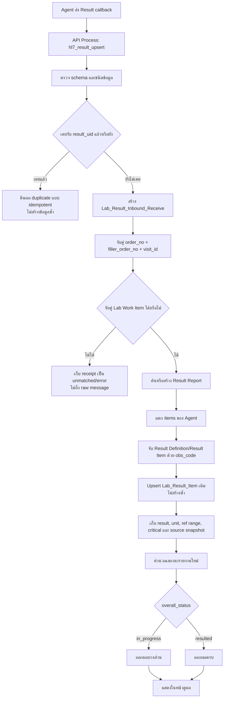

# Handoff — การรับผล Lab จาก Agent เข้าสู่ HIS

อัปเดต: 25 สิงหาคม 2569 (Asia/Bangkok)

## จุดประสงค์

เอกสารนี้สรุป flow รับผลตรวจจาก Agent, การจัดเก็บข้อมูลใน HIS, บทบาทของฟอร์ม 3 ตัว และขอบเขต Manual Result เพื่อให้ session ถัดไปทำงานต่อโดยไม่สับสนระหว่างฟอร์มรับข้อความ, หัวรายงาน และผลรายรายการ

## แหล่งอ้างอิง

- `HIS_AGENT_Interface_Easy.drawio` — หน้า `Flow Overview` และ `Field Mapping`
- `HIS_AGENT_Interface_Schema.md`
- `schemas/agent-to-his-result.schema.json`
- `LIS_HIS_INTEGRATION_HANDOFF.md`
- `LAB_MANUAL_RESULT_HANDOFF.md`
- `Lab_Result_Inbound_Receive_Design.md`

## ข้อสรุปเรื่อง Draw.io และฟอร์ม 3 ตัว

Flow ใน Draw.io ยืนยันเรื่องต่อไปนี้:

- Agent callback เข้า HIS ผ่าน `hl7_result_upsert`
- HIS กันข้อความซ้ำด้วย `result_uid`
- HIS ตรวจจับคู่ด้วย `order_no + filler_order_no + visit_id`
- `filler_order_no` คือ LAB NO. ที่ HIS ส่งออกไปในชื่อ `labno`
- Result Item จับด้วย `items[].obs_code = his_code_id` ตาม checkpoint ปัจจุบัน
- เก็บ receipt/version แบบ append-only
- `overall_status = in_progress` แสดงผลบางส่วน และ `resulted` แสดงผลครบ
- เมื่อ Agent ส่ง critical rule มา HIS เก็บและแสดง Critical โดยไม่คำนวณ threshold ซ้ำ

Draw.io **ไม่ได้ระบุชื่อฟอร์มหรือบังคับว่าต้องมี 3 ฟอร์ม** การแยกเป็น 3 ฟอร์มเป็นการออกแบบ persistence ฝั่ง HIS เพื่อรองรับ idempotency, audit, รายงานหนึ่งชุดที่มีหลายผล และใช้โครงเดียวกันร่วมกันระหว่าง LIS กับ Manual Result

ดังนั้นคำตอบคือ: **โครง 3 ฟอร์มสอดคล้องกับ flow ใน Draw.io แต่ไม่ได้คัดจำนวนฟอร์มมาจาก Draw.io โดยตรง**

## ฟอร์มจริงที่ต้องมี

มี **3 ฟอร์มจริง** ไม่ใช่ 5 ฟอร์ม:

| ลำดับ | ฟอร์ม | หน้าที่ | ความสัมพันธ์ |
|---|---|---|---|
| 1 | `Lab_Result_Inbound_Receive` | Technical receipt รับ callback จาก Agent หนึ่ง record ต่อ `result_uid` | ไม่ Join Parent เพื่อเก็บ unmatched/duplicate/error ได้ |
| 2 | `Result_Report_Manual_Entry` | หัวรายงาน/Workspace ของผลหนึ่งชุด รองรับ `source_mode = manual \| lis \| mixed` | ผูกกับ Lab Work Item/Order Status |
| 3 | `Lab_Result_Item` | ผลตรวจราย test/OBS หนึ่ง record ต่อ result component | ลูกของ Result Report |

ไฟล์ต่อไปนี้เป็น **JSON UI ของฟอร์มเดิม** ไม่ใช่ฟอร์มเพิ่ม:

| JSON UI | ต้อง import ให้ฟอร์ม |
|---|---|
| `Lab_Result_Inbound_Receive_User_View_EMR_Person_v2.json` | `Lab_Result_Inbound_Receive` |
| `Lab_Result_Item_Minimal_Widget_Critical.json` | `Lab_Result_Item` |

ห้าม import `Lab_Result_Inbound_Receive_User_View_EMR_Person_v2.json` ทับ `Lab_Result_Item` เพราะ ListView ในไฟล์นี้ชี้ไปที่ Form ID ของ `Lab_Result_Item` อยู่แล้ว การ import ทับจะทำให้ฟอร์มอ้างรายการกลับมาหาตัวเอง

## Flow รับผลจาก Agent



## รายละเอียดแต่ละขั้น

### 1. รับ callback

Agent เรียก Process/API ของ HIS ไม่ได้บันทึกเข้าตัว ListView โดยตรง ฟอร์ม JSON เป็น schema/UI ส่วน Process เป็นผู้ validate และเขียนข้อมูล

### 2. กันข้อความซ้ำ

- ใช้ `result_uid` เป็น message idempotency key
- การส่งข้อความเดิมซ้ำต้องไม่สร้าง receipt/report/item ซ้ำ
- `receipt_seq` คือจำนวนครั้ง/ลำดับการรับ message ไม่ใช่ `result_version`
- Correction ต้องเก็บค่าเดิมและเพิ่ม version/audit ห้ามเขียนทับประวัติเดิมแบบสูญหาย

### 3. สร้าง Technical Receipt

สร้าง `Lab_Result_Inbound_Receive` หนึ่ง record ต่อ `result_uid` ก่อน materialize ผล เพื่อให้เก็บข้อความที่จับคู่ไม่สำเร็จ, duplicate หรือ error ไว้ตรวจย้อนหลังได้

ข้อมูล technical เช่น raw payload, schema version, channel, receipt status และข้อความ error ต้องเก็บเป็น internal/read-only ไม่ใช่ช่องให้ผู้ใช้แก้

### 4. จับคู่ Order

ใช้ร่วมกันอย่างน้อย:

```text
order_no
filler_order_no (LAB NO.)
visit_id
```

ห้ามจับคู่ด้วย HN หรือ LAB NO. เพียงค่าเดียว HN/VN ใช้แสดงบริบทผู้ป่วยและช่วย cross-check แต่ไม่ใช่ parent key ของ Result Item

### 5. สร้างหรือค้น Result Report

Result Report เป็นหัวรวมผลของ Lab Work Item/Lab No. และรองรับทั้ง LIS กับ Manual ด้วย `source_mode`

ต้องยืนยัน implementation key สุดท้ายให้รองรับ `report_seq` และ `stage` แบบ append-only โดยไม่ทำลายกติกาเดิมที่ต้องมี logical report ต่อ Work Item ห้ามเดา compound key ก่อนตรวจ API/ฐานข้อมูลจริง

### 6. Materialize Result Items

Agent ส่ง `items[]` และแต่ละ item กลายเป็น `Lab_Result_Item` โดยใช้ stable key ที่รวม report/result definition หรือ source result key เพื่อ upsert record เดิม

Field mapping checkpoint ปัจจุบัน:

| Agent result | HIS Result Item |
|---|---|
| `items[].obs_code` | `obs_code` / ใช้หา Result Definition |
| `items[].obs_name` | `test_name` snapshot |
| `items[].value` | `result_value` |
| `items[].units` | `unit_symbol_snapshot` และอ้าง Unit Master เมื่อ map ได้ |
| `items[].ref_range` | `reference_range_snapshot` |
| `items[].obx_status` | `obx_status` |
| `items[].change_kind` | `change_kind` |
| `items[].receipt_seq` | `receipt_seq` raw string |
| `items[].result_version` | `result_version` |
| `critical_low_rule` / `critical_high_rule` | critical snapshot/alert ตาม contract |

### 7. Partial/Complete

- `overall_status = in_progress` → ออกผลบางส่วน
- `overall_status = resulted` → ออกผลครบ
- รายการที่ยังไม่ออกต้องแสดง `pending`
- Completion rule ราย test ยังต้องยืนยันกับ Lab user ว่ารายการใด `required_for_completion`

## การแสดงผลและข้อจำกัด ListView

- `Lab_Result_Inbound_Receive_User_View_EMR_Person_v2.json` เป็นหน้าดู receipt และรายการผล ไม่ใช่ endpoint รับข้อมูล
- ListView อ่านข้อมูลจาก `Lab_Result_Item`
- Preview ยืนยันแล้วว่า ListView แสดงกรอบได้แม้มี 0 รายการ
- Form Manage CRUD ยืนยันแล้วว่าไม่แสดง `list-ui` แม้ไฟล์แม่แบบเดียวกันแสดงใน Preview
- หน้าดูผลจริงจึงต้องทดสอบใน App/View runtime ที่รองรับ ListView ไม่ควรใช้ Form Manage CRUD เป็นหลักฐานว่า ListView เสีย
- ยังห้ามกล่าวว่า App runtime ใช้งานได้จนกว่าจะทดสอบจริง

## Manual Result

Manual Result ไม่เขียนเข้า `Lab_Result_Inbound_Receive` แต่ใช้ `Result_Report_Manual_Entry` และ `Lab_Result_Item` ชุดเดียวกับผล LIS เพื่อให้หน้าดูผลรวมกันได้

กติกาล่าสุด:

| กลุ่ม | Result | Unit | Reference range | Critical |
|---|---|---|---|---|
| Lab ปกติ | Manual ได้เฉพาะกรณีที่อนุญาต | Read-only จาก LIS/Definition | Read-only จาก LIS/Definition | Read-only จาก Agent/LIS |
| Micrology ตามชื่อที่ผู้ใช้ระบุ | Manual | ไม่มี Unit/ไม่แสดง | แสดงเฉพาะเมื่อมีข้อมูล | Manual พร้อม audit |

สำหรับ Lab ปกติ หน้ากรอก Manual ควรเปิดให้แก้เฉพาะ `result_value` และอาจมี `result_comment` ส่วน Unit, Ref. Range และ Critical ต้องไม่เปิดให้ผู้ใช้แก้

ข้อยกเว้น Micrology ยังต้องยืนยันชื่อ/รหัส `lab_section` จริง และรูปแบบการกรอก Critical ว่าใช้ Boolean, interpretation code หรือข้อความ ก่อน implement ห้ามเดา

## สถานะปัจจุบัน

สิ่งที่มีแล้ว:

- JSON technical receipt
- JSON UI สำหรับ inbound user view
- Result Report และ Result Item schema/UI รุ่นทำงาน
- Agent result JSON Schema และ diagram mapping
- static tests บางส่วนสำหรับ JSON/hierarchy/mapping

สิ่งที่ยังไม่ยืนยัน end-to-end:

- Process รับ callback จริงและสร้าง receipt
- การจับคู่ Work Item ด้วยข้อมูลจริง
- การสร้าง/ค้น Report แบบ idempotent
- การแตก `items[]` และ upsert Result Item
- Partial/complete status
- Correction/version history
- App runtime แสดง ListView และเปิดดูผล
- Manual submit/update/audit

ดังนั้นระบบยังไม่ production-ready และห้ามกล่าวว่า Agent/Manual flow ใช้งานจริงจนกว่าจะผ่านการทดสอบทั้งหมด

## Test checklist ก่อนปิดงาน

1. ส่ง payload ใหม่ → สร้าง receipt หนึ่ง record
2. ส่ง `result_uid` เดิมซ้ำ → ไม่สร้าง receipt/report/item ซ้ำ
3. Order match สำเร็จด้วย `order_no + filler_order_no + visit_id`
4. Order match ไม่สำเร็จ → เก็บ unmatched receipt และ error reason
5. Payload หลาย items → สร้าง/อัปเดต Result Item ครบทุก item
6. ส่ง partial สองรอบ → update item เดิมและสถานะออกผลบางส่วน
7. ส่ง completed → ออกผลครบและ stamp เวลาตามกติกา
8. ส่ง corrected result → เก็บ version และประวัติค่าเดิม
9. ส่ง critical → แสดง alert โดยไม่คำนวณ threshold ซ้ำ
10. เปิด App/View → เห็น ListView แม้ไม่มีข้อมูล และเห็น items เมื่อมีข้อมูล
11. Manual ปกติ → แก้ได้เฉพาะผล/หมายเหตุ
12. Micrology → กรอกผลและ critical ได้โดยไม่มี Unit พร้อม audit

## จุดเริ่มต้นสำหรับ session ถัดไป

1. อ่าน `MEMORY.md`
2. อ่าน `LIS_HIS_INTEGRATION_HANDOFF.md`
3. อ่าน `LAB_MANUAL_RESULT_HANDOFF.md`
4. อ่าน `SDFORM_JSON_RULES.md` ก่อนแก้ SDForm JSON ทุกครั้ง
5. ตรวจไฟล์ที่ถือเป็น latest และสถานะ import/live ก่อนแก้
6. ห้ามแก้ JSON จนกว่าจะระบุชัดว่าจะทำ receipt, report, result item หรือ viewer UI
7. รัน validator/static tests และให้ผู้ใช้ยืนยัน Builder/Preview/App runtime ก่อน claim ว่าใช้งานได้
